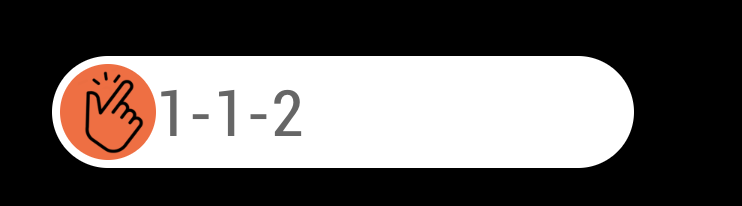

# MMM-Clap
MagicMirror controlling with hand-clap or finger-snap




## Installation
### 0.PreInstall
**Linux (Raspbian, Ubuntu, ...)**
```sh
sudo apt-get install sox
```

**Mac OSX**
```sh
brew install sox
```

### 1.Install
```sh
cd ~/MagicMirror/modules
git clone https://github.com/eouia/MMM-Clap
```

## Configuration
### Simple & Test
```js
{
  module: "MMM-Clap",
  position: "top_left",
  config: {
    detector: {
      recordDevice: "plughw:1",
    },
    defaultCommandMode: "MODE_DEFAULT",
    commands: {
      "MODE_DEFAULT": {
        "1": {
          notificationExec: {
            notification: "SHOW_ALERT",
            payload: {message: "You clapped.", timer:3000}
          },
          restart:true,
        },
      },
    }
  }
},
```

### Detail & Defaults
You don't need to copy and paste all of below codes; Just use only you need.
```js
config: {
  useDisplay:true, // If you don't want to display this module, set this to `false`
  startOnBoot: true,
  detector: {
    recordBackbone: "alsa", // "waveaudio", "coreaudio"
    recordDevice: "plughw:1", // "-d", "default"

    // For OSX :
      // recordBackbone : "coreaudio"
      // recordDevice : "default"
    // For Windows :
      // recordBackbone : "waveaudio"
      // recordDevice : "-d"

    thresholdDetectionStart: "5%", // minimum noise percentage threshold necessary to start recording sound (0~100%)
    thresholdDetectionEnd: "5%", // minimum noise percentage threshold necessary to end recording sound (0~100%)
    thresholdClapAmplitude: 0.7, // minimum amplitude threshold to be considered as clap (0~1)
    thresholdClapEnergy: 0.3, // maximum energy threshold to be considered as clap (0~1)
    duration: 500,
  },
  clapsTimeout:1000,
  sequenceTimeout:2000,
  defaultCommandMode: "MODE_DEFAULT",
  commands: {
    "MODE_DEFAULT": {
      "1": {
        notificationExec: {
          notification: "SHOW_ALERT",
          payload: {message: "You clapped.", timer:3000}
        },
        restart:true,
      },
    },
  }
},
```


## Usage
### Notification
- `CLAP_PAUSE` : You can pause this module by this notification. You might need to pause this module before other module trying to use Mic.
- `CLAP_RESUME` : You can resume this module by this notification.
- `CLAP_MODE`(payload: "ModeName") : You can change/set `commandMode` by this notification.

### CommandMode
This module can have several command modes, so you can assign same pattern to different commands by condition.
```js
defaultCommandMode: "COMMAND_MODE_DEFAULT"
commands: {
  "COMMAND_MODE_DEFAULT" : {
    "1": {
      // do something
    }
  },
  "COMMAND_MODE_ALTERNATIVE" : {
    "1": {
      // do other thing
    }
  }
}
```
You can change the commandMode by notification `CLAP_MODE`.

### Clap Sequence
```js
clapsTimeout:1000,
sequenceTimeout:2000,
```
By `clapsTimeout` and `sequenceTimeout`, you can define your clap pattern.

- `"1"` is clapping once and stop.
- `"2"` is clapping once and clapping again in `clapsTimeout`. (like Clap-Clap)
- `"1-1"` is clapping once, pausing over `clapsTimeout` but not `sequenceTimeout`, then clapping again. (like Clap-(pause)-Clap)

I don't recommend too complex patterns. You would probably make some mistakes on your clapping/finger-snapping.


### Commands
You can make a custom command for your clapping pattern(or sequence).

#### 0. Common
You can define your custom commands like this;
```js
defaultCommandMode: "MODE_NAME"
commands: {
  "MODE_NAME": {
    "CLAPPING-SEQUENCE-PATTERN": {
      notificationExec: { ... },
      // And/Or
      shellExec: { ... },
      // And/Or
      moduleExec: { ... },
    },
    restart: false,
    alias: "YOUR_PATTERN_NAME"
  }
  ...
}
```

### 1. notificationExec
Command can emit `notification` of MagicMirror. When you need to activate other module with notification, this could.
```js
"1-1-1": {
  notificationExec: {
    notification: "SHOW_ALERT",
    payload: {message:"You clapped 3 times.", timer:2000}
  }
}
```
- `notification` : `String` or `callback function()` which will return String
```js
notification: () => {
  if (SOME CONDITION) {
    return "SOME_NOTIFICATION"
  } else {
    return "OTHER_NOTIFICATION"
  }
}
```
- `payload` : Any `Variables`(include Object) could be. Or `callback function()` which will return `payload` could be.
```js
payload: () => {
  return {"currentTime": Date.now()}
}
```

## 2. shellExec
Command can execute some simple shell script (e.g: python or bash script). But it just executes the shell command. Process executed by this is not controllable or manageable. If you need more, make your own module for it.
```js
"1-1-1": {
  shellExec: {
    exec: "sudo reboot now"
  }
}
```
- `exec`: String or callback function also.

## 3. moduleExec
Command can also handle module(s) itself.
```js
"1-1-1": {
  moduleExec: {
    module: ["clock"],
    exec: (module, time) => {
      module.hide()
    }
  }
}
```
- `module` : `String` of target module name or `Array` of names of target modules or just `[]`(for all modules). And also could be `callback` function which will return string or array.
```js
module: "clock", // This means `clock` module
module: ["clock"], // same with above.
module: ["clock", "calendar"] // This means `clock` module and `calendar` module
module: [], // This means targeting all modules
module: () => { return "clock" },
module: () => { return ["clock", "calendar"]}
module: () => { return [] }
```
- `exec` : `callback` function to do its job. Arguments are slightly different with other callbacks.
```js
exec: (module) => {
  module.hide()
}
```
  - `module`: would be targeted module(s)

## 4. restart
If you need to stop this module after specific clap pattern detection, set `restart` to `false`
```js
"1-1-1": {
  shellExec: {
    exec: "python myscript.sh"
  },
  restart:false
}
```
In this case, `MMM-Clap` won't restart after "1-1-1" detection. You need to use `CLAP_RESUME` notification to resume this module.


## 5. alias
`alias` is just the name of your clap pattern & command. Optional.

### Example
#### Toggling Show/Hide by just 1 snap with commandMode
```js
defaultCommandMode: "Thanos",
commands: {
  "Thanos": {
    "1": {
      moduleExec: {
        module: [],
        exec: (module) => {
          module.hide()
          if (module.name == "MMM-Clap") module.notificationReceived("CLAP_MODE", "Avengers")
        }
      },
    },
  },
  "Avengers": {
    "1": {
      moduleExec: {
        module: [],
        exec: (module) => {
          module.show()
          if (module.name == "MMM-Clap") module.notificationReceived("CLAP_MODE", "Thanos")
        }
      },
    }
  }
}

```

#### Activate MMM-AssistantMk2
```js
defaultCommandMode: "DEFAULT"
commands: {
  "DEFAULT": {
    "1": {
      notificationExec: {
        notification: "ASSISTANT_ACTIVATE",
        payload: {profile: "default"}
      },
      restart:false
    }
  }
}
```
> You should call `CLAP_RESUME` & `CLAP_PAUSE` in MMM-AssistantMk2 to obtain/release MIC control.
